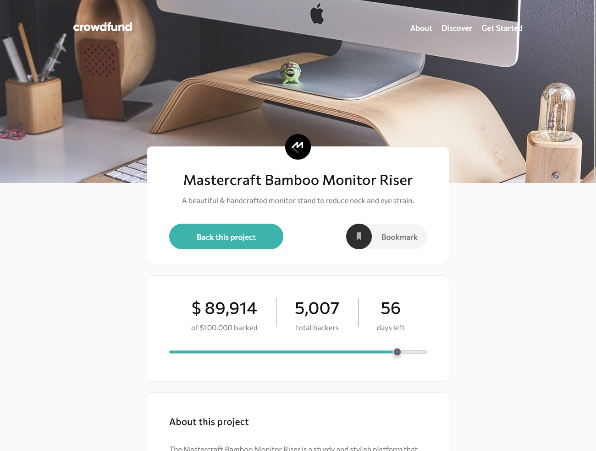

# Crowdfunding product page

Participatory funding product page where users can select certain offers to increase funding. Users can add a bookmark to the products they wish to finance. 

The stories are hosted on Chromatic at this [URL]().

  

   

## User stories

Your users should be able to:

- [x] Make a selection of which pledge to make
- [x] See an updated progress bar and total money raised based on their pledge total after confirming a pledge
- [x] See the number of total backers increment by one after confirming a pledge
- [x] Toggle whether or not the product is bookmarked
- [x] View the optimal layout depending on their device's screen size
- [x] See hover states for interactive elements

## Built with

- Semantic HTML5 markup
- Mobile-first workflow
- TailwindCSS
- React
- Storybook
- Chromatic

## Author

- Website - [Portfolio](https://calcagno-loic.netlify.app/)
- Frontend Mentor - [@CalcagnoLoic](https://www.frontendmentor.io/profile/CalcagnoLoic)